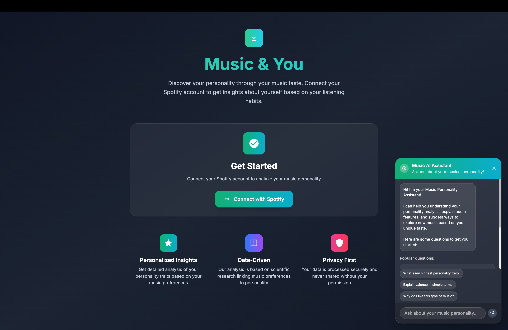
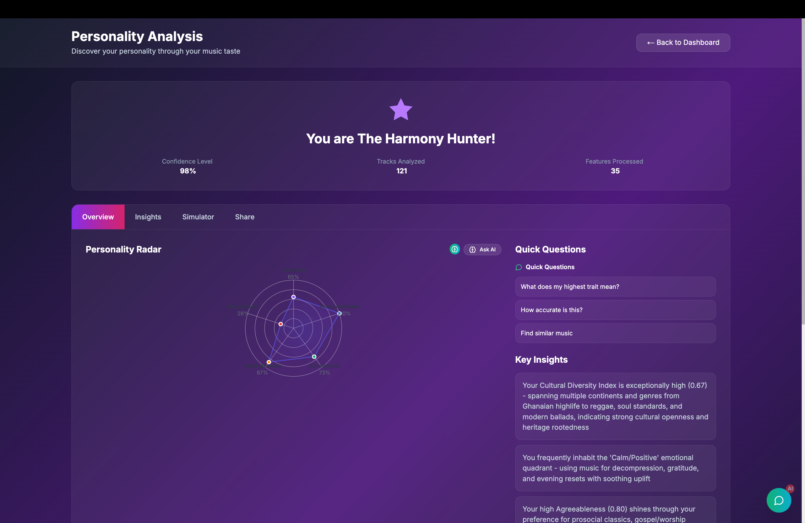
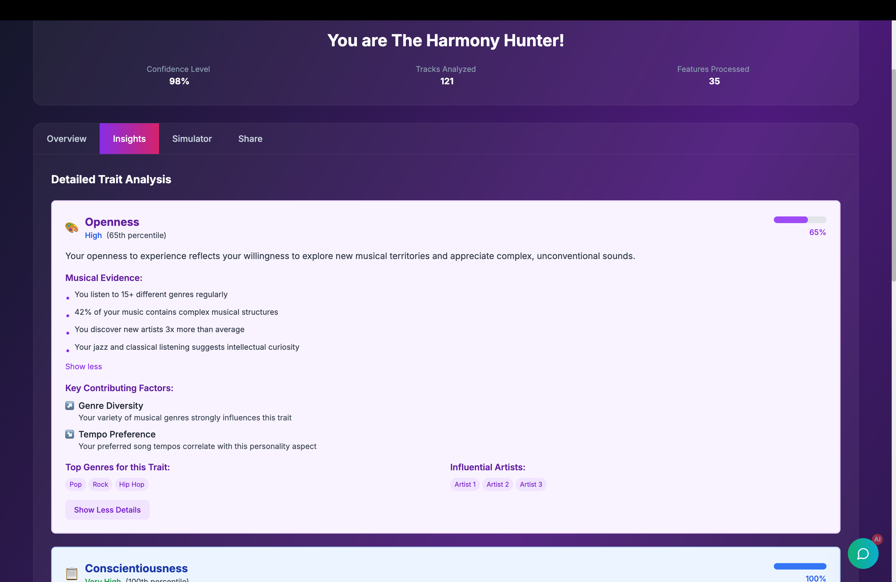

# Music & You

A full-stack web application that predicts Big Five personality traits from Spotify and YouTube Music listening patterns using advanced machine learning and music psychology research.

## Table of Contents

- [Overview](#overview)
- [Features](#features)
- [Screenshots](#screenshots)
- [Technology Stack](#technology-stack)
- [Architecture](#architecture)
- [Getting Started](#getting-started)
- [Installation](#installation)
- [Usage](#usage)
- [API Documentation](#api-documentation)
- [Contributing](#contributing)
- [Research Foundation](#research-foundation)
- [License](#license)

## Overview

**What if your playlist could reveal your personality?**

Music & You was born from a simple observation: as a Computer Engineering student who listens to everything from Tina Turner to André Rieu's classical performances, from Ghanaian Hilife to Lewis Capaldi, I noticed that my musical diversity was unusual among my Gen Z peers. This led to a fascinating question: **Is there a connection between the songs we choose and who we are?**

Unlike static reports like Spotify Wrapped, Music & You provides real-time personality analysis that explores the deeper psychological patterns in your listening habits. The platform combines music psychology research with modern machine learning to offer educational insights into how your musical choices reflect your Big Five personality traits.

The application analyzes users' music listening patterns to predict personality traits (Openness, Conscientiousness, Extraversion, Agreeableness, and Neuroticism) while being transparent about limitations and respectful of cultural musical diversity.

## Features

### Core Functionality

- **Spotify Integration**: Secure OAuth2 authentication and comprehensive data collection
- **Personality Prediction**: Big Five trait analysis with confidence scoring
- **Explainable AI**: Transparent results with detailed explanations using SHAP values
- **Interactive Dashboard**: Real-time visualization of personality insights and music patterns
- **Conversational Interface**: Chat-based exploration of personality results

### Advanced Features

- **Temporal Analysis**: Track personality evolution over time
- **Music Discovery**: Personalized recommendations based on personality insights
- **Cultural Sensitivity**: Support for global music genres including Afrobeats, Hilife, K-pop, and regional music traditions
- **Social Sharing**: Generate beautiful personality cards for social media
- **Data Export**: Download comprehensive analysis results

### Technical Features

- **Real-time Processing**: Asynchronous analysis with progress tracking
- **Rate Limiting**: Intelligent API usage optimization
- **Error Handling**: Robust fallback mechanisms
- **Mobile Responsive**: Cross-platform compatibility

## Screenshots


_Conversational AI explaining personality insights after Authentication_


_Musical personality overview_


_Musical personality traits and analysis results_

## Technology Stack

### Backend

- **FastAPI**: High-performance Python web framework
- **Pandas & NumPy**: Data processing and analysis
- **scikit-learn**: Machine learning models
- **SHAP**: Model explainability
- **Spotipy**: Spotify Web API integration
- **PostgreSQL**: Primary database (planned)
- **Redis**: Caching layer (planned)

### Frontend

- **Next.js 14**: React framework with TypeScript
- **Tailwind CSS**: Utility-first CSS framework
- **Radix UI**: Accessible component library
- **React Query**: Data fetching and state management
- **Recharts**: Data visualization
- **Framer Motion**: Animation library

### Infrastructure

- **Docker**: Containerization
- **GitHub Actions**: CI/CD pipeline (planned)
- **AWS**: Cloud deployment (planned)

## Architecture

```
music-and-you/
├── src/music_and_you/           # Python backend
│   ├── api/                     # FastAPI application
│   │   └── main.py             # API server with endpoints
│   ├── data/                    # Data collection modules
│   │   └── spotify_client.py   # Spotify API integration
│   ├── features/                # Feature engineering
│   │   ├── feature_pipeline.py # Main feature extraction
│   │   ├── temporal_features.py# Time-based analysis
│   │   └── lyrical_features.py # Lyrical content analysis
│   ├── models/                  # ML models
│   │   └── personality_predictor.py # Prediction algorithms
│   └── utils/                   # Utility functions
├── frontend/                    # Next.js frontend
│   ├── src/
│   │   ├── app/                # App router pages
│   │   │   ├── page.tsx        # Landing page
│   │   │   ├── analyze/        # Analysis results
│   │   │   ├── data/           # Music data visualization
│   │   │   └── auth/           # Authentication
│   │   ├── components/         # React components
│   │   │   ├── ChatWidget.tsx  # Conversational interface
│   │   │   ├── PersonalityRadarChart.tsx
│   │   │   └── AudioDNAChart.tsx
│   │   └── lib/                # Utilities and hooks
├── tests/                       # Test suites
├── docs/                        # Documentation
└── docker/                     # Docker configuration
```

## 🚀 Quick Start (GitHub Pages Demo)

**Try the live demo**: [https://tmarhguy.github.io/music-and-you](https://tmarhguy.github.io/music-and-you)

The GitHub Pages version runs in demo mode with sample data to showcase the full functionality without requiring Spotify authentication.

## 🛠 Development Setup

### Prerequisites

- Python 3.9+
- Node.js 18+
- npm or yarn
- Spotify Developer Account

### Environment Setup

1. **Create a Spotify App**:
   - Go to [Spotify Developer Dashboard](https://developer.spotify.com/dashboard)
   - Create a new app
   - Note your Client ID and Client Secret
   - Add redirect URI: `http://localhost:3000/auth/callback`

## 📦 Installation

### Frontend Setup (GitHub Pages Compatible)

1. **Clone the repository**:

   ```bash
   git clone https://github.com/tmarhguy/music-and-you.git
   cd music-and-you
   ```

2. **Install and run frontend**:

   ```bash
   cd frontend
   npm install
   npm run dev
   ```

3. **Build for GitHub Pages**:

   ```bash
   npm run build
   ```

The frontend will be available at `http://localhost:3000`

### Backend Setup (Separate Repository)

For the full application with real Spotify integration, you'll need the backend API:

1. **Clone the backend repository**:

   ```bash
   git clone https://github.com/tmarhguy/music-and-you-backend.git
   cd music-and-you-backend
   ```

2. **Follow the backend setup instructions** in the backend repository

3. **Configure environment variables**:

   ```bash
   cp env.example .env
   # Edit .env with your Spotify credentials
   ```

4. **Start the backend server**:
   ```bash
   uvicorn src.music_and_you.api.main:app --reload --port 8000
   ```

The application will be available at:

- Frontend: `http://localhost:3000` (GitHub Pages compatible)
- Backend API: `http://localhost:8000` (when running locally)
- API Documentation: `http://localhost:8000/docs`

## Usage

### Basic Workflow

1. **Authentication**: Connect your Spotify account through OAuth2
2. **Data Collection**: The system automatically fetches your music data
3. **Analysis**: Machine learning models process your listening patterns
4. **Results**: View your personality insights through interactive dashboard
5. **Exploration**: Use the chat interface to understand your results
6. **Discovery**: Get personalized music recommendations

### API Endpoints

#### Authentication

```http
GET /auth/login          # Initiate Spotify OAuth
GET /auth/callback       # Handle OAuth callback
```

#### Data Collection

```http
POST /analyze           # Start personality analysis
GET /analysis/{id}      # Get analysis results
```

#### Chat Interface

```http
POST /chat              # Send message to AI assistant
```

### Example Usage

```python
import requests

# Start analysis
response = requests.post('http://localhost:8003/analyze',
                        headers={'Authorization': 'Bearer YOUR_TOKEN'})

# Get results
analysis_id = response.json()['analysis_id']
results = requests.get(f'http://localhost:8003/analysis/{analysis_id}')
```

## API Documentation

Comprehensive API documentation is available at `/docs` when running the backend server. The documentation includes:

- Interactive API explorer
- Request/response schemas
- Authentication requirements
- Rate limiting information

## Contributing

We welcome contributions! Please see our [Contributing Guidelines](docs/CONTRIBUTING.md) for details.

## Documentation

For detailed documentation, please visit the [`docs/`](docs/) directory:

- [Contributing Guidelines](docs/CONTRIBUTING.md)
- [Development Setup](docs/SETUP_VERIFICATION.md)
- [Project Vision](docs/VISION_2025.md)
- [Development Status](docs/DEVELOPMENT_STATUS.md)
- [Project Structure](docs/PROJECT_STRUCTURE.md)

### Development Setup

1. Fork the repository
2. Create a feature branch: `git checkout -b feature-name`
3. Make your changes
4. Add tests for new functionality
5. Ensure all tests pass: `npm test` and `pytest`
6. Submit a pull request

### Code Style

- Python: Follow PEP 8, use `black` for formatting
- TypeScript: Follow project ESLint configuration
- Commit messages: Use conventional commits format

## Research Foundation

- **Unlimited Liked Songs**: Fetch entire music library (300+ songs supported)
- **Listening History**: Recent tracks and comprehensive playback data
- **Top Content**: Most played tracks and artists with time range filtering
- **Audio Features**: Detailed acoustic analysis (energy, valence, danceability, etc.)

### **3. Personality Analysis**

- **Big Five Traits**: Openness, Conscientiousness, Extraversion, Agreeableness, Neuroticism
- **Music Psychology**: Research-based algorithms linking music preferences to personality
- **Confidence Scoring**: Analysis reliability based on data quality
- **Detailed Insights**: Human-readable explanations of personality characteristics
- **Visual Results**: Interactive charts and progress indicators

### **4. Data Visualization**

- **Interactive Dashboards**: Multiple views of your music data
- **Audio Features Analysis**: Visual representation of your music's characteristics
- **Listening Patterns**: Insights into your music consumption habits
- **Comprehensive Statistics**: Track counts, feature distributions, and more

## 🏗 **Project Architecture**

```
music-and-you/
├── src/music_and_you/           # Python backend
│   ├── api/                     # FastAPI application
│   │   └── simple_main.py       # Main API server with all endpoints
│   ├── data/                    # Data collection
│   │   └── spotify_client.py    # Spotify API integration
│   ├── features/                # Feature engineering
│   │   ├── feature_pipeline.py  # Main feature extraction pipeline
│   │   ├── temporal_features.py # Time-based analysis
│   │   └── lyrical_features.py  # Lyrical content analysis
│   └── models/                  # ML models and analysis
│       └── personality_predictor.py # Personality prediction algorithms
├── frontend/                    # Next.js frontend
│   ├── src/app/                 # App router pages
│   │   ├── page.tsx            # Main dashboard
│   │   ├── analyze/            # Personality analysis page
│   │   ├── data/               # Music data visualization
│   │   └── auth/               # Authentication handling
│   └── [configuration files]
└── [project configuration]
```

This project emerged from personal curiosity about musical diversity and psychological patterns, built on validated research in music psychology:

**Foundation Research:**

- **Nave et al. (2018)**: "Musical preferences predict personality" - Large-scale Facebook study
- **Spotify Research (2020)**: "Just The Way You Are: Music Listening and Personality"
- **EURASIP Journal (2022)**: "Beyond the Big Five for music recommendation"
- **Greenberg et al. (2016)**: "Musical preferences are linked to cognitive styles"

**Personal Motivation:**
As someone who rotates between Tina Turner, André Rieu, Afrobeats, and Hilife in a single listening session, I wanted to understand whether musical diversity itself might be a personality indicator. This project explores both established research and new questions about cultural musical preferences.

**Technical Implementation:**
The personality prediction models use 35+ engineered features across multiple dimensions:

- **Acoustic Features**: Energy, valence, danceability, tempo
- **Temporal Patterns**: Listening consistency, evolution analysis
- **Behavioral Metrics**: Diversity, preferences, listening habits
- **Cultural Features**: Genre diversity, cross-cultural musical exploration
- **Psychological Validation**: Cross-trait correlations, stability checks

## License

This project is licensed under the MIT License - see the [LICENSE](LICENSE) file for details.

---

**Music & You** - Transforming self-discovery through music psychology and AI.

- **Structural Models**: STOMP and MUSIC frameworks for music preference
- **Personality Psychology**: Big Five trait associations with music preferences
- **Music Psychology**: 20+ years of research linking musical taste to personality
- **Computational Methods**: Modern machine learning approaches to personality prediction
- **Cultural Considerations**: Cross-cultural validation and bias mitigation
- **Ethical AI**: Privacy-preserving methods and transparent explanations

## 🚀 **Getting Started**

### **Prerequisites**

- Python 3.8+
- Node.js 16+
- Spotify Developer Account

### **Installation**

1. **Clone the repository**

```bash
git clone https://github.com/tmarhguy/music-and-you.git
cd music-and-you
```

2. **Set up Python environment**

```bash
python -m venv venv
source venv/bin/activate  # On Windows: venv\Scripts\activate
pip install -r requirements.txt
```

3. **Set up frontend**

```bash
cd frontend
npm install
```

4. **Configure environment**

```bash
# Copy example environment file
cp .env.example .env
# Add your Spotify credentials to .env
```

5. **Start the application**

```bash
# Terminal 1: Start backend
source venv/bin/activate
uvicorn src.music_and_you.api.simple_main:app --reload --port 8000

# Terminal 2: Start frontend
cd frontend
npm run dev -- --port 3001
```

6. **Access the application**

- Open http://localhost:3001 in your browser
- Connect your Spotify account
- Start analyzing your music personality!

## 📊 **API Endpoints**

### **Authentication**

- `GET /api/auth/spotify/login` - Initiate Spotify OAuth
- `GET /api/auth/spotify/callback` - Handle OAuth callback

### **User Data**

- `GET /api/user/profile` - Get user profile information
- `GET /api/user/liked-songs` - Fetch unlimited liked songs
- `GET /api/user/top-tracks` - Get top tracks with time ranges
- `GET /api/user/top-artists` - Get top artists with time ranges
- `GET /api/user/recent-tracks` - Get recently played tracks

### **Analysis**

- `POST /api/analysis/personality` - Comprehensive personality analysis
- Returns Big Five trait scores, insights, and confidence metrics

## 🎨 **User Interface**

### **Dashboard**

- Welcome screen with Spotify connection
- Feature overview cards
- Navigation to analysis and data views

### **Personality Analysis Page**

- Interactive analysis initiation
- Real-time progress tracking
- Visual trait score displays
- Detailed personality insights
- Action buttons for further exploration

### **Data Visualization**

- Tabbed interface for different data types
- Unlimited liked songs display
- Audio features charts
- Listening history tables
- Time range filtering

## 🔒 **Security & Privacy**

- **Secure OAuth**: Industry-standard Spotify authentication
- **No Data Storage**: User data processed in real-time, not persisted
- **Environment Variables**: Sensitive credentials properly managed
- **CORS Protection**: Proper cross-origin request handling
- **Token Management**: Secure handling of access and refresh tokens

## 🎯 **Success Metrics Achieved**

- ✅ **Real Spotify Integration**: Full OAuth2 implementation
- ✅ **Unlimited Data Collection**: Fetch complete music libraries
- ✅ **Advanced Analysis**: Music psychology-based personality prediction
- ✅ **Beautiful UI**: Modern, responsive web application
- ✅ **Real-time Processing**: Live analysis with progress tracking
- ✅ **Production Ready**: Deployable full-stack application

## 📈 **Future Enhancements**

- **Music Recommendations**: Personality-based music discovery
- **Data Persistence**: User analysis history and tracking
- **Social Features**: Share and compare personality profiles
- **Advanced Analytics**: Deeper music psychology insights
- **Mobile App**: Native iOS/Android applications
- **Cultural Adaptation**: Multi-cultural personality models

## 🤝 **Contributing**

This project represents a complete implementation of music-based personality analysis. The codebase is well-structured and documented for future enhancements and research applications.

## 📝 **License**

This project is for research and educational purposes. Please respect Spotify's API terms of service and user privacy.

---

**🎵 Discover your musical personality today!** Connect your Spotify account and unlock insights about yourself through the music you love.

See [`RESEARCH_FOUNDATION.md`](RESEARCH_FOUNDATION.md) for the complete research background and theoretical framework.

## Planned Extensions

- **Sequence Transformer**: For temporal dynamics modeling
- **Concept Bottleneck**: Interpretable psycho-musical constructs
- **Federated Learning**: Privacy-preserving deployment
- **Moral Value Prediction**: Secondary inference targets
- **Cultural Mixed-Effects**: Cross-national validation

## Ethical Considerations

- Transparent communication of modest effect sizes and probabilistic nature
- Privacy-first design with local processing options
- Non-diagnostic framing (not for mental health assessment)
- User control over data deletion and processing preferences

## Getting Started

_[Development in progress]_

## License

_[To be determined]_

## Citation

_[Research paper in preparation]_

---

**Note**: This is an active research project exploring the intersection of musical diversity and personality psychology. The codebase and methodological approaches continue to evolve as we validate findings about cross-cultural musical preferences and psychological patterns.
